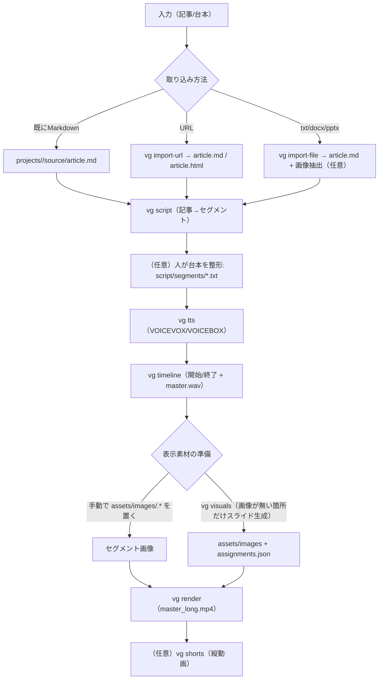
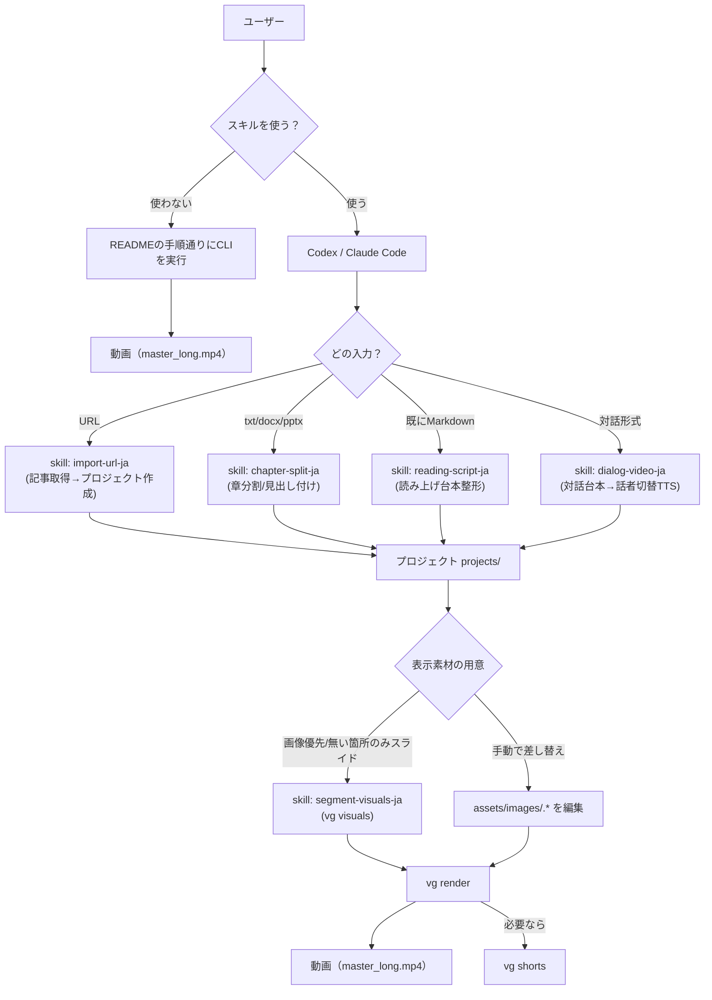
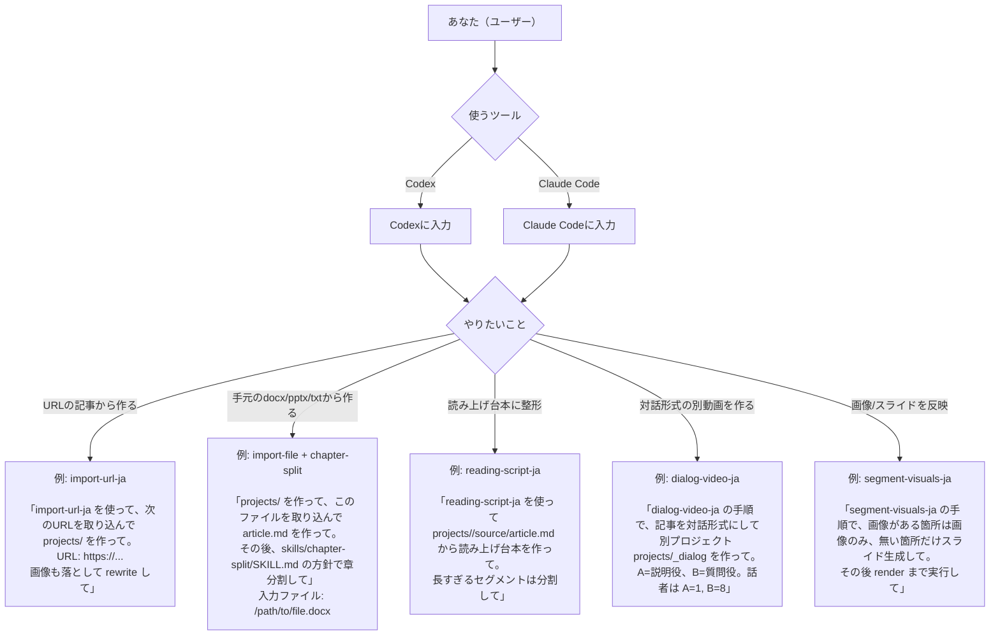

# 動画生成（半自動）

記事（Markdown）をベースに、解説動画（長尺）を半自動で生成し、必要なら Shorts（縦動画）も切り出すためのリポジトリです。

このREADMEは **Windows / macOS** と、作業支援に **Codex / Claude Code** を使う人のどちらにも通じるように書いています（AIが無くても使えます）。

## できること（MVP）

- 記事をプロジェクト（`projects/{slug}`）として管理
- 記事→読み上げ台本セグメント（`script/segments/*.txt`）を生成して、人が整形
- VOICEVOX（VOICEBOX互換API）で TTS（wav）生成
- セグメントごとに「画像 or スライド」を割り当てて長尺動画（mp4）を書き出し

## ディレクトリ構成（プロジェクト単位）

```
projects/
  {slug}/
    project.json
    source/
      article.md
      article.html        # URL取り込み時（任意）
    script/
      segments.json
      segments/
        0001_intro.txt
        0002_....txt
      timeline.json       # 生成（任意）
    assets/
      images/
        article/          # 記事内画像DL（任意）
        assignments.json  # visuals割当ログ（任意）
      slides/
      bgm/
    audio/      # 生成物（gitignore）
    render/     # 中間生成物（gitignore）
    export/     # mp4等（gitignore）
    cache/      # 生成キャッシュ（gitignore）
vg/            # CLI + ライブラリ
skills/        # 手順書（Codex向けSkillもここで管理）
```

## 必要条件（共通）

- Python 3.10+（推奨）
- `ffmpeg`（動画の書き出しに必要）
  - ※ `drawtext` フィルタが無い ffmpeg では、プレースホルダーへの文字描画が省略されます
- VOICEVOX（VOICEBOX互換API）がローカルで起動していること
  - 例：`http://localhost:50021`

## セットアップ

### 1) Python（依存ライブラリ）

このリポジトリは `python -m vg ...` で動きます。まず依存を入れます（`visuals` / スライド生成に `Pillow` を使用）。

macOS / Linux:

```
python -m venv .venv
source .venv/bin/activate
python -m pip install -r requirements.txt
```

Windows（PowerShell）:

```
py -m venv .venv
.\.venv\Scripts\Activate.ps1
python -m pip install -r requirements.txt
```

### 2) ffmpeg

macOS（Homebrew）:

```
brew install ffmpeg
```

Windows（例：winget）:

```
winget install Gyan.FFmpeg
```

### 3) VOICEVOX（ローカルTTS）

- VOICEVOX（または VOICEBOX の互換API）をインストールして起動
- エンジンが `http://localhost:50021` で動いていることを確認
- 話者は `projects/{slug}/project.json` の `tts.speaker` で指定（デフォルトは 1）

## 使い方（最短）

## フロー図（動画生成まで）



## フロー図（スキル利用：Codex / Claude Code）



## フロー図（AIへの依頼例：コピペ用）



### 1) サンプル案件を動かす

```
python -m vg script projects/example
python -m vg tts projects/example
python -m vg timeline projects/example --concat-wav
python -m vg render projects/example
```

出力:
- `projects/example/audio/*.wav`
- `projects/example/script/timeline.json`
- `projects/example/export/master.wav`
- `projects/example/export/master_long.mp4`

### 2) 新しい案件を作る

#### A) 既にMarkdownがある場合

```
python -m vg init my-article
```

`projects/my-article/source/article.md` を差し替えて、以下の順で回します。

```
python -m vg script projects/my-article
python -m vg tts projects/my-article
python -m vg timeline projects/my-article --concat-wav
python -m vg render projects/my-article
```

#### B) URLから記事を取り込む（実験的）

記事のHTMLを取得してMarkdown化し、プロジェクトを作ります。

```
python -m vg import-url "https://example.com/article" --slug my-article
```

記事内画像もローカルに落として、Markdownの画像参照も書き換える場合:

```
python -m vg import-url "https://example.com/article" --slug my-article --fetch-images --rewrite-images
```

または後から画像だけ落とす場合:

```
python -m vg fetch-images projects/my-article --md source/article.md --out-dir assets/images/article --rewrite
```

#### C) txt / docx / pptx から取り込む（実験的）

```
python -m vg import-file /path/to/article.docx --slug my-article --title "タイトル"
```

取り込み元を `projects/{slug}/source/input.*` にコピーし、`projects/{slug}/source/article.md` を生成します。
docx/pptx の場合は埋め込み画像を `projects/{slug}/assets/images/source/` に抽出します（不要なら `--no-extract-images`）。

#### D) 対話形式（会話）で作る（実験的）

1行＝1発話の `dialog.md` を作り、話者を切り替えてTTSします。

1) `projects/{slug}/script/dialog.md` を作る（例: `A: ...` / `B: ...`）
2) `projects/{slug}/project.json` に話者を設定（例）

```json
{
  "dialog": { "speakers": { "A": 1, "B": 8 } }
}
```

3) コンパイル → 生成

```
python -m vg dialog projects/{slug} --force
python -m vg tts projects/{slug}
python -m vg timeline projects/{slug} --concat-wav
python -m vg render projects/{slug} --force
```

#### E) 話者（VOICEVOX / VOICEBOX）をセグメントごとに分ける（実験的）

対話形式は `dialog.md` の `A(1): ...` / `B(8): ...` のように行単位で指定できます。

対話形式でない場合でも、`segments.json` に `speaker` を入れることで、TTS時に話者を切り替えられます。

```
python -m vg assign-speakers projects/{slug} --speakers 1,8
python -m vg tts projects/{slug} --force
```

### 3) 画像/スライドを動画に反映する

`render` は `assets/images/{segment_id}.png|jpg|jpeg` があるとそれを表示します。

- 画像があるところは画像のみ
- 画像がないところだけスライドを生成

```
python -m vg visuals projects/{slug} --force
python -m vg render projects/{slug} --force
```

先頭のアイキャッチを差し替えたい場合:

- `projects/{slug}/assets/images/article/eyecatch_override.png` を置く → `visuals` を再実行

## Shorts（任意）

`projects/{slug}/project.json` の `shorts` に以下いずれかで指定し、生成します。

- セグメントID指定（推奨）
  - `{"id":"s1","title":"...","segments":["0002_イントロ","0003_本編"]}`
- 秒指定
  - `{"id":"s2","title":"...","start":12.3,"end":42.0}`

生成:

```
python -m vg shorts projects/{slug}
```

## Codex / Claude Code での「スキル」利用

このリポジトリの `skills/*/SKILL.md` は、作業手順（プレイブック）です。

### Codex

Codex の Skill はPC全体（`~/.codex/skills/`）にコピーして使います。

macOS / Linux:

```
mkdir -p ~/.codex/skills/reading-script-ja
rsync -a --delete skills/reading-script/ ~/.codex/skills/reading-script-ja/
mkdir -p ~/.codex/skills/import-url-ja
rsync -a --delete skills/import-url/ ~/.codex/skills/import-url-ja/
mkdir -p ~/.codex/skills/segment-visuals-ja
rsync -a --delete skills/segment-visuals/ ~/.codex/skills/segment-visuals-ja/
mkdir -p ~/.codex/skills/chapter-split-ja
rsync -a --delete skills/chapter-split/ ~/.codex/skills/chapter-split-ja/
mkdir -p ~/.codex/skills/dialog-video-ja
rsync -a --delete skills/dialog-video/ ~/.codex/skills/dialog-video-ja/
mkdir -p ~/.codex/skills/speaker-assign-ja
rsync -a --delete skills/speaker-assign/ ~/.codex/skills/speaker-assign-ja/
```

Windows（PowerShell）例:

```
New-Item -ItemType Directory -Force $HOME\.codex\skills\reading-script-ja | Out-Null
Copy-Item -Recurse -Force skills\reading-script\* $HOME\.codex\skills\reading-script-ja\
```

### Claude Code

Claude Code には Codex と同じ「Skillインストール」機構はありません（環境により異なります）。
代わりに、Claude Code に `skills/*/SKILL.md` のパスを渡して「この手順に従って実行して」と依頼するのが簡単です。

例:
- 「`skills/reading-script/SKILL.md` の手順で `projects/my-article/source/article.md` から台本を作って」
- 「`skills/segment-visuals/SKILL.md` の手順で、画像がある箇所は画像のみ、無い箇所だけスライドにして」
- 「`skills/chapter-split/SKILL.md` の手順で、見出し付け（章分割）してから台本を作って」
- 「`skills/dialog-video/SKILL.md` の手順で、対話形式の台本→話者切り替えTTS→動画生成して」
- 「`skills/speaker-assign/SKILL.md` の手順で、内容に応じて話者を割り当てて」

## 公開リポジトリ向けの注意

- `.gitignore` で `projects/*` を基本的に除外し、`projects/example` と `projects/sample01` のみ残す設定にしています
- 生成物（`audio/`, `render/`, `export/`, `cache/`）はプロジェクト内でも除外対象です

## トラブルシュート

- `VOICEVOX(VOICEBOX) に接続できませんでした` が出る場合:
  - VOICEVOXエンジンが起動しているか（`http://localhost:50021`）
  - `projects/{slug}/project.json` の `tts.base_url` が合っているか
- `visuals` で `Pillow が必要です` が出る場合:
  - `python -m pip install -r requirements.txt` を実行
