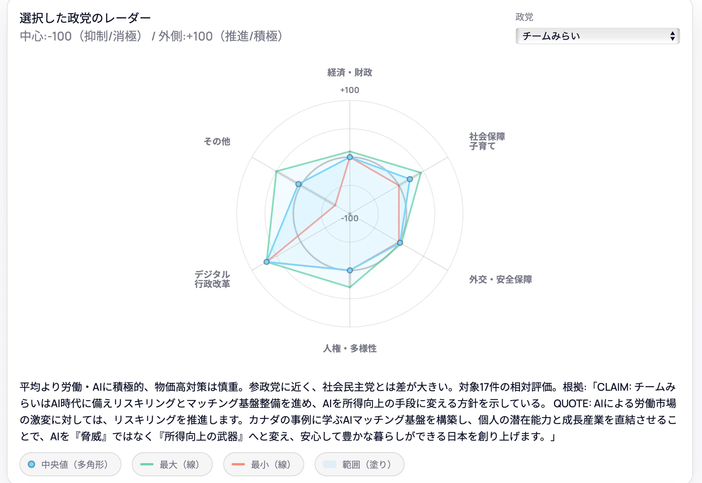
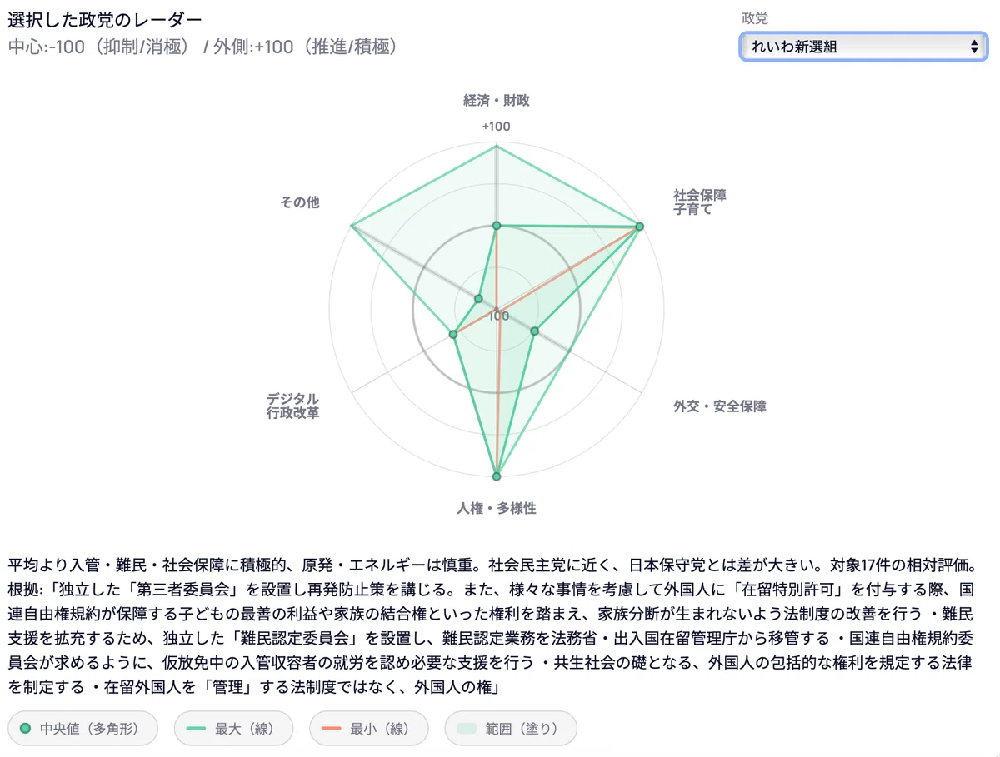
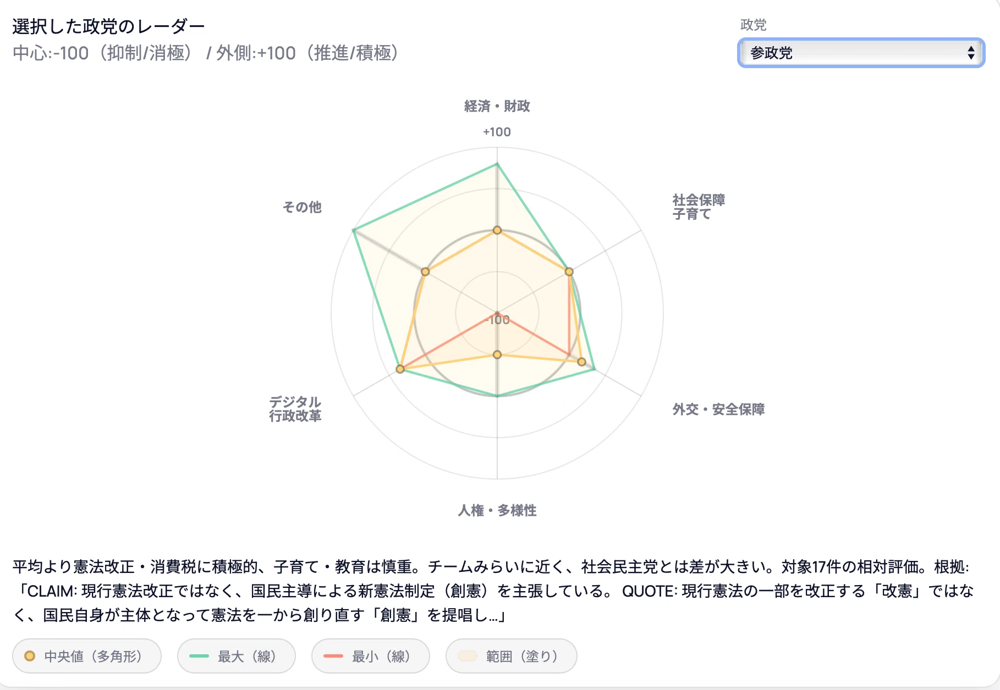
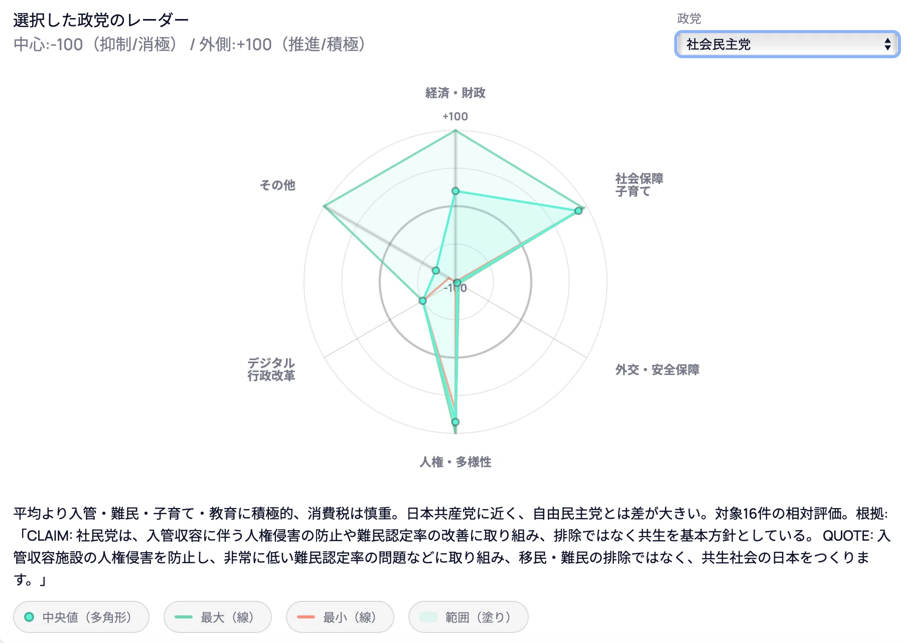
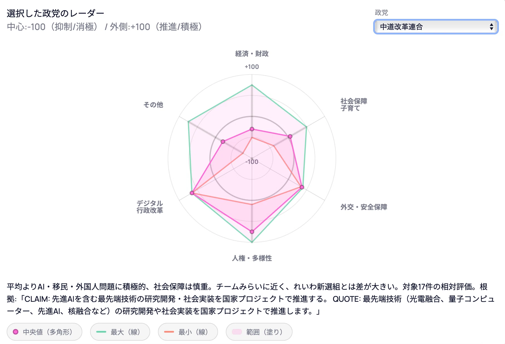
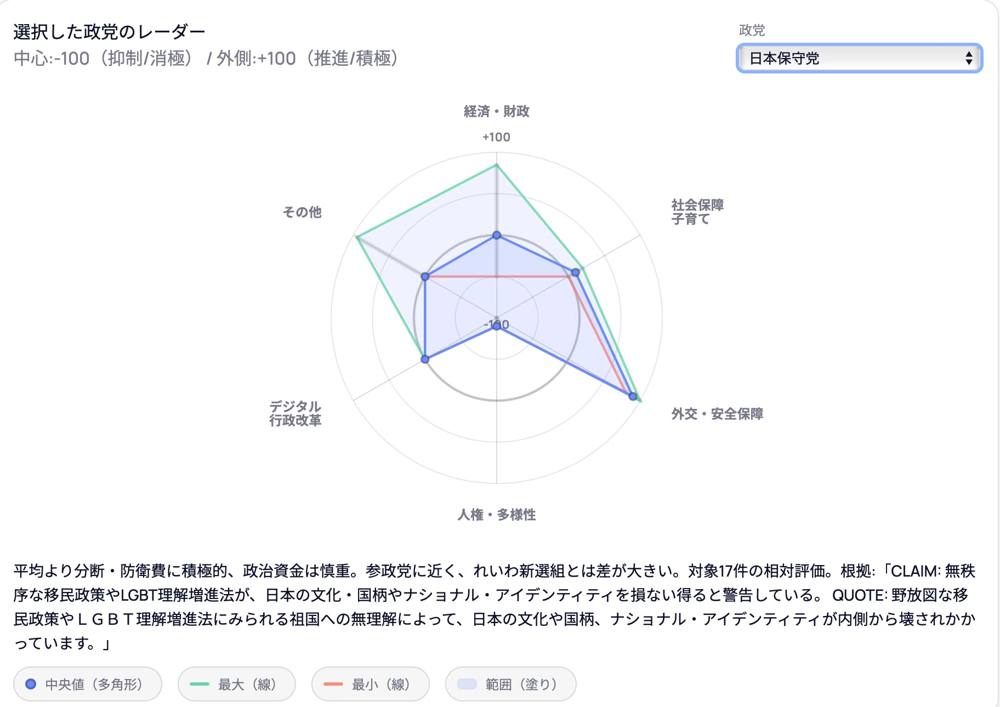

# 各政党の方針・姿勢のAIによる見える化アプリケーションについて（2026年衆院選マニュフェストより）

各党の姿勢・方針を見えるかするアプリケーションを各党の衆院選マニュフェストをベースにアップデートしました。

アプリケーション  
[PartyViz - 政党の立場可視化](https://partyviz.ryosailabo.com)

いくつか情報を取りこぼしていると思われる箇所もありますが、かなり実態に近い分析ができるようになっていると思います。  
アプリケーションで分析した各党の概要について記載していきたいと思います。（アプリケーションの分析結果をそのままお伝えします。政策に関する優劣や評価はここでは行いません。）

順番は、ランダムです。  
各トピックや分析の根拠はアプリケーションから直接確認して下さい。

## 1. チームみらい

平均より労働・AIに積極的、物価高対策は慎重。参政党に近く、社会民主党とは差が大きい。対象17件の相対評価。根拠:「チームみらいはAI時代に備えリスキリングとマッチング基盤整備を進め、AIを所得向上の手段に変える方針を示している。 AIによる労働市場の激変に対しては、リスキリングを推進します。カナダの事例に学ぶAIマッチング基盤を構築し、個人の潜在能力と成長産業を直結させることで、AIを『脅威』ではなく『所得向上の武器』へと変え、安心して豊かな暮らしができる日本を創り上げます。」

## 2. れいわ新撰組

平均より入管・難民・社会保障に積極的、原発・エネルギーは慎重。社会民主党に近く、日本保守党とは差が大きい。対象17件の相対評価。根拠:「独立した「第三者委員会」を設置し再発防止策を講じる。また、様々な事情を考慮して外国人に「在留特別許可」を付与する際、国連自由権規約が保障する子どもの最善の利益や家族の結合権といった権利を踏まえ、家族分断が生まれないよう法制度の改善を行う ・難民支援を拡充するため、独立した「難民認定委員会」を設置し、難民認定業務を法務省・出入国在留管理庁から移管する ・国連自由権規約委員会が求めるように、仮放免中の入管収容者の就労を認め必要な支援を行う ・共生社会の礎となる、外国人の包括的な権利を規定する法律を制定する ・在留外国人を「管理」する法制度ではなく、外国人の権」

## 3. 国民民主党

平均より議員定数の削減・財政に積極的、分断は慎重。中道改革連合に近く、日本保守党とは差が大きい。対象17件の相対評価。根拠:「選挙制度改革とセットで『議員定数の削減』を掲げている。 QU抜本的な選挙制度改革（中選挙区連記制、議員定数の削減、参議院の合区解消）、国会におけるデジタル化等の国会改革を推進」

## 4. 参政党

平均より憲法改正・消費税に積極的、子育て・教育は慎重。チームみらいに近く、社会民主党とは差が大きい。対象17件の相対評価。根拠:「現行憲法改正ではなく、国民主導による新憲法制定（創憲）を主張している。 現行憲法の一部を改正する「改憲」ではなく、国民自身が主体となって憲法を一から創り直す「創憲」を提唱

## 5. 自由民主党

平均より原発・エネルギー・防衛費に積極的、入管・難民は慎重。チームみらいに近く、社会民主党とは差が大きい。対象17件の相対評価。根拠:「安全最優先・規制委審査尊重のもとで再稼働を進め、廃炉決定サイト内での次世代革新炉への建替えも具体化する方針である。 原子力規制委員会により…新規制基準に適合すると認められた場合には、その判断を尊重し原発の再稼働を進めます。…廃炉を決定した原子力発電所を有する事業者の原子力発電所のサイト内での次世代革新炉への建て替えを対象として、具体化を進めていきます。 政権公約2026では、AI・DXによる電力需要増を踏まえ原発再稼働を進める方針を明記。総合政策集2026（J-ファイル）でも、安全性最優先・規制委審査尊重のも」

## 6. 社会民主党

平均より入管・難民・子育て・教育に積極的、消費税は慎重。日本共産党に近く、自由民主党とは差が大きい。対象16件の相対評価。根拠:「社民党は、入管収容に伴う人権侵害の防止や難民認定率の改善に取り組み、排除ではなく共生を基本方針としている。 入管収容施設の人権侵害を防止し、非常に低い難民認定率の問題などに取り組み、移民・難民の排除ではなく、共生社会の日本をつくります。」

## 7. 中道改革連合

平均よりAI・移民・外国人問題に積極的、社会保障は慎重。チームみらいに近く、れいわ新選組とは差が大きい。対象17件の相対評価。根拠:「先進AIを含む最先端技術の研究開発・社会実装を国家プロジェクトで推進する。 最先端技術（光電融合、量子コンピューター、先進AI、核融合など）の研究開発や社会実装を国家プロジェクトで推進します。」

## 8. 日本維新の会

平均より労働・消費税に積極的、財政は慎重。チームみらいに近く、れいわ新選組とは差が大きい。対象17件の相対評価。根拠:「同一労働同一賃金の徹底に向け、年功序列型から職務・職責に基づく賃金制度への転換を進める。 「同一労働同一賃金」を徹底するため、契約形態による年功序列型の職能給制度から、職務・職責による制度への転換を進めます。 労働問題」

## 9. 日本共産党

平均より社会保障・ジェンダー・家族に積極的、議員定数の削減は慎重。社会民主党に近く、日本保守党とは差が大きい。対象17件の相対評価。根拠:「所得制限なしに幼児教育と保育の無償化を進める方針を示している。 幼児教育・保育の無償化を進めます」

## 10. 日本保守党

平均より分断・防衛費に積極的、政治資金は慎重。参政党に近く、れいわ新選組とは差が大きい。対象17件の相対評価。根拠:「無秩序な移民政策やLGBT理解増進法が、日本の文化・国柄やナショナル・アイデンティティを損ない得ると警告している。 野放図な移民政策やＬＧＢＴ理解増進法にみられる祖国への無理解によって、日本の文化や国柄、ナショナル・アイデンティティが内側から壊されかかっています。」

## まとめ

とりあえず、各党のレーダーチャートと分析結果の要旨画面を貼りました。  
アプリケーションからは、各政策トピックのスコアとその根拠を確認することができます。  
詳細を知りたい方はアプリケーションを利用して下さい。

## 所感

今回は、ChatGPTのdeep researchの結果を取り込んだため、以前よりかなり精度の高い結果になったと思います。  
各党自分がイメージしていた方針・姿勢におおよそ一致した結果になったと思います。  
ただ、一部情報の取りこぼしと思われる結果もあるので、気になった点は一次情報を確認するようにして下さい。

githubのレポジトリーは以下になります。

ダウンロード

copy